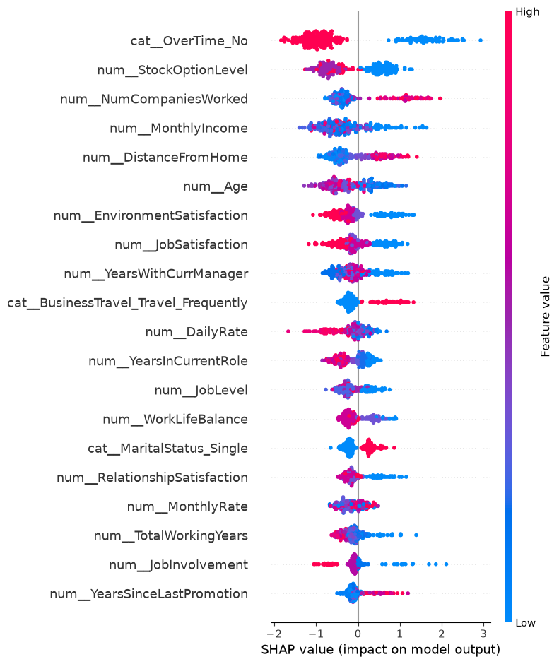
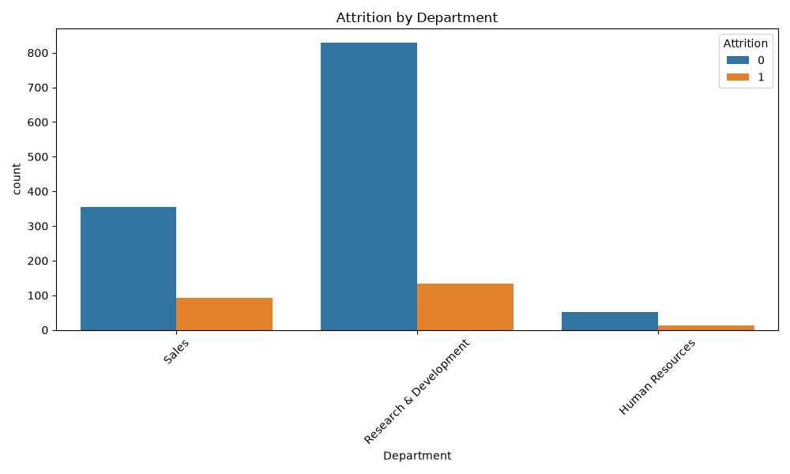
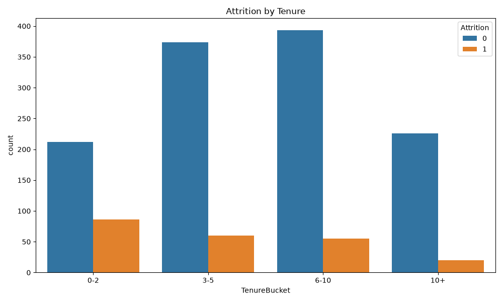

# Employee Attrition Prediction — XGBoost + SHAP

A machine learning project that analyzes employee attrition patterns and predicts the likelihood of employee turnover using the IBM HR Analytics dataset.

The project demonstrates an end-to-end analytics and machine learning workflow, including data preprocessing, feature engineering, exploratory analysis, model development, performance evaluation, and model explainability.

## 🎯 Project Objectives

* Analyze patterns associated with employee attrition.
* Identify variables that contribute to model-predicted attrition risk.
* Build an employee attrition prediction model using XGBoost.
* Evaluate model performance using ROC-AUC.
* Use SHAP to explain model predictions.
* Visualize attrition patterns across departments and employee tenure.
* Translate model findings into potential HR workforce insights.

## 📂 Repository Structure

```text
employee-attrition-ml/
│
├── data/
│   └── HR-Employee-Attrition.csv
│
├── notebooks/
│   └── attrition_analysis.py
│
├── visuals/
│   ├── shap_summary.png
│   ├── attrition_by_department.png
│   └── attrition_by_tenure.png
│
└── README.md
```

## 📊 Dataset

The project uses the **IBM HR Analytics Employee Attrition & Performance** dataset.

The dataset contains **1,470 employee records** and more than 30 HR-related variables covering areas such as:

* **Demographics:** Age, Gender, MaritalStatus
* **Job characteristics:** JobRole, Department, JobLevel
* **Compensation:** MonthlyIncome, StockOptionLevel
* **Employee satisfaction:** JobSatisfaction, EnvironmentSatisfaction
* **Tenure:** YearsAtCompany, YearsInCurrentRole
* **Work conditions:** OverTime, BusinessTravel
* **Target variable:** Attrition

The target variable was converted from:

```text
Yes → 1
No  → 0
```

## 🧠 Feature Engineering

Two additional features were created to make employee characteristics easier to analyze:

### TenureBucket

Employees were grouped based on their years at the company:

* 0–2 years
* 3–5 years
* 6–10 years
* 10+ years

### IncomeBucket

Monthly income was divided into four groups:

* Low
* Mid
* High
* Very High

Categorical variables were converted using `OneHotEncoder`, while numeric variables were passed directly into the model.

## 🤖 Machine Learning Pipeline

The model was built using a Scikit-learn `Pipeline` and `ColumnTransformer`.

### Preprocessing

* `OneHotEncoder` for categorical variables
* Passthrough of numeric variables
* `handle_unknown='ignore'` to prevent errors from unseen categorical values

### Model

**XGBoost Classifier**

XGBoost was selected because it can capture nonlinear relationships and interactions between employee characteristics.

### Evaluation

The dataset was divided into:

* **80% training data**
* **20% testing data**

Model performance was evaluated using **ROC-AUC**.

**ROC-AUC: 0.79**

This indicates that the model demonstrated useful ability to distinguish between employees who left and those who remained in the test dataset.

> Note: This evaluation represents a single train/test split and should not be interpreted as proof that the model would achieve the same performance on new organizational data.

## 🔍 Model Explainability with SHAP

SHAP (SHapley Additive exPlanations) was used to examine which features had the greatest influence on the model's predictions.

The SHAP summary plot provides two types of information:

* **Feature importance:** which variables have the greatest overall impact on predictions.
* **Direction of influence:** whether higher/lower feature values tend to push individual predictions toward higher or lower predicted attrition.

This helps move the analysis beyond simply asking:

> "Can we predict attrition?"

and toward:

> "Which employee characteristics are contributing most to the model's predictions?"

## 📈 Visualizations

### 1. SHAP Summary Plot

Shows the features that have the greatest influence on model predictions and the direction of their contribution.



### 2. Attrition by Department

Compares employee attrition across departments.



### 3. Attrition by Tenure

Examines how attrition varies across employee tenure groups.



## 💡 Key Findings

The analysis identified several patterns associated with employee attrition in the dataset:

* **Overtime:** Employees working overtime were associated with higher predicted attrition risk.
* **Income:** Monthly income was an important variable in the model, with higher income generally associated with lower predicted attrition.
* **Stock options:** StockOptionLevel contributed to differences in model-predicted attrition.
* **Business travel:** Frequent business travel was associated with higher predicted attrition.
* **Job satisfaction:** Lower satisfaction levels contributed to higher predicted attrition.
* **Tenure:** Employees with shorter tenure showed higher observed attrition in the dataset.

These findings describe patterns within the dataset and model. They should not be interpreted as causal relationships.

## 🛠️ Technologies Used

* **Python**
* **Pandas** — data manipulation and feature engineering
* **Scikit-learn** — preprocessing, pipelines, train/test split, and evaluation
* **XGBoost** — machine learning model
* **SHAP** — model explainability
* **Seaborn** — data visualization
* **Matplotlib** — visualization and chart export

## 🚀 How to Run

Clone the repository and install the required dependencies:

```bash
pip install -r requirements.txt
```

Run the analysis:

```bash
python notebooks/attrition_analysis.py
```

The script trains the model, calculates ROC-AUC, generates SHAP explanations, and saves the visualizations to the `visuals/` directory.

## 🔮 Future Improvements

Potential next steps include:

* Compare XGBoost against Logistic Regression and Random Forest.
* Perform cross-validation for more robust model evaluation.
* Tune XGBoost hyperparameters.
* Evaluate precision, recall, F1-score, and confusion matrix results.
* Address class imbalance using appropriate evaluation and modeling techniques.
* Add an interactive Power BI or Streamlit dashboard.
* Create employee-level prediction explanations.
* Deploy the model through an API for demonstration purposes.

## 👤 Author

**Kaden Davis**

Analytics professional focused on **data analytics, SAP systems, and predictive modeling**.

This project is part of my analytics portfolio and demonstrates my ability to transform raw data into analytical insights, build predictive models, and communicate machine learning results in a business context.

## 🧩 Business Application

Employee attrition analysis can help organizations understand workforce patterns and identify areas that may warrant further investigation.

In a real-world HR environment, a model such as this could potentially support:

* Workforce planning
* Employee retention analysis
* Identification of turnover patterns
* HR reporting and analytics
* Further investigation into factors associated with employee turnover

Any real-world deployment would require additional validation, monitoring, fairness assessment, privacy considerations, and organization-specific data before being used to inform employee decisions.
